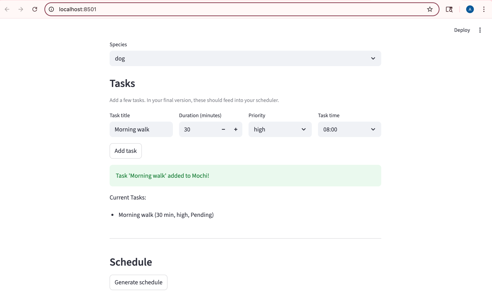
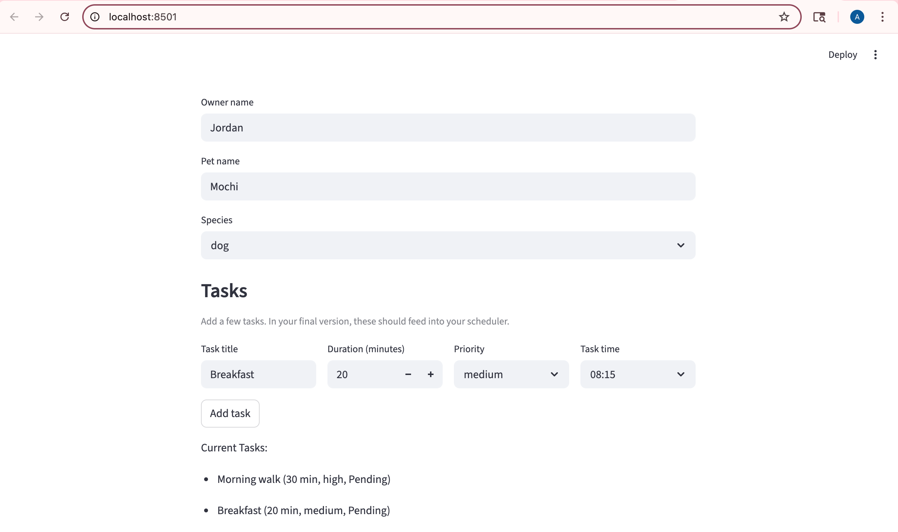
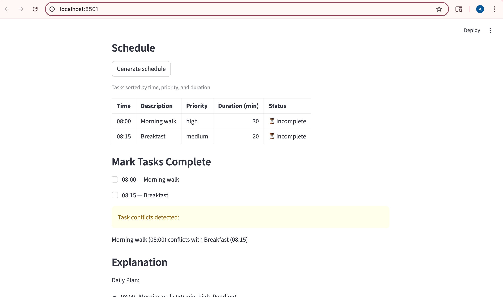
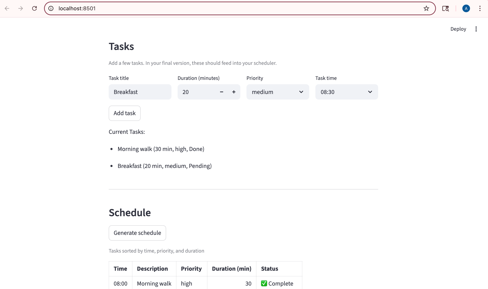
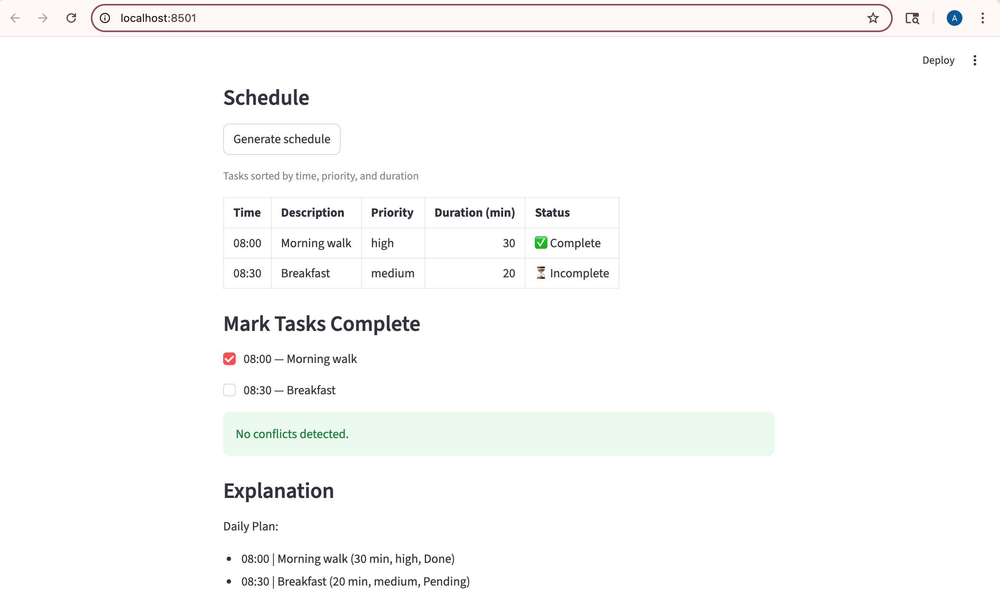

# PawPal+ (Module 2 Project)

You are building **PawPal+**, a Streamlit app that helps a pet owner plan care tasks for their pet.

## Scenario

A busy pet owner needs help staying consistent with pet care. They want an assistant that can:

- Track pet care tasks (walks, feeding, meds, enrichment, grooming, etc.)
- Consider constraints (time available, priority, owner preferences)
- Produce a daily plan and explain why it chose that plan

Your job is to design the system first (UML), then implement the logic in Python, then connect it to the Streamlit UI.

## What you will build

Your final app should:

- Let a user enter basic owner + pet info
- Let a user add/edit tasks (duration + priority at minimum)
- Generate a daily schedule/plan based on constraints and priorities
- Display the plan clearly (and ideally explain the reasoning)
- Include tests for the most important scheduling behaviors

## ✨ Features

- **Task Sorting** – Organize tasks chronologically by start time, with secondary sorting by priority and duration.
- **Conflict Detection** – Identify overlapping tasks that cannot be completed simultaneously.
- **Daily Recurrence** – Automatically generate a new task instance when a daily recurring task is marked complete.
- **Pet Filtering** – Retrieve and filter tasks by pet name with case-insensitive matching.
- **Interactive Task Completion** – Mark tasks as done in the UI and generate next-day instances for recurring tasks.
- **Daily Plan Explanation** – Display a clear, readable breakdown of the day's schedule with task times, durations, priorities, and status.

## 📸 Demo

**Full Schedule View**
**Task Added**
<a href="images/pawpal_screenshot_1.png" target="_blank"></a>

**Current Tasks**
<a href="images/pawpal_screenshot_2.png" target="_blank"></a>

**Conflict Detection**
<a href="images/pawpal_conflict_3.png" target="_blank"></a>

**Making Task Complete**
<a href="images/pawpal_screenshot_4.png" target="_blank"></a>

**No conflict**
<a href="images/pawpal_no_conflict_5.png" target="_blank"></a>

## Smarter Scheduling

The system includes several algorithmic improvements:

- Tasks are sorted by time, priority, and duration
- Tasks can be filtered by pet using the `filter_by_pet(owner, pet_name)` method (demonstrated in the CLI demo)
- Basic conflict detection identifies overlapping tasks
- Daily recurring tasks generate a new instance when completed using `new_task = task.mark_complete()` and `pet.add_task(new_task)` (demonstrated in the CLI demo)

These features improve usability while keeping the system simple and readable.

## Testing PawPal+

Run the automated test suite with:

```bash
python -m pytest
python -m pytest tests/test_pawpal.py -v
```

The test suite contains 18 tests that verify core system behavior, including:

- Task sorting by time, priority, and duration
- Conflict detection for overlapping and back-to-back tasks
- Filtering tasks by pet (case-insensitive matching)
- Daily recurring task generation when a task is marked complete
- Edge case safety across all scheduler methods (empty lists, missing pets)

All 18 tests pass, confirming the system behaves as expected across both happy paths and edge cases.

**Confidence Level: ⭐⭐⭐⭐⭐ (5/5)**

## Getting started

### Setup

```bash
python -m venv .venv
source .venv/bin/activate  # Windows: .venv\Scripts\activate
pip install -r requirements.txt
```

### Suggested workflow

1. Read the scenario carefully and identify requirements and edge cases.
2. Draft a UML diagram (classes, attributes, methods, relationships).
3. Convert UML into Python class stubs (no logic yet).
4. Implement scheduling logic in small increments.
5. Add tests to verify key behaviors.
6. Connect your logic to the Streamlit UI in `app.py`.
7. Refine UML so it matches what you actually built.
